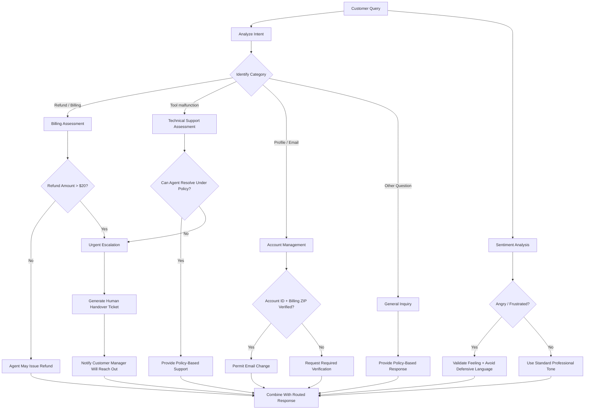

## Chatbot System Description

### 1. System Instructions

The chatbot is configured as a **SaaS customer-support assistant for FlexTime** with several specialized operating modes:

* **Support Ticket Classifier:** Classifies customer requests into Billing, Technical Support, Account Management, General Inquiry, or Urgent Escalation, and independently identifies sentiment as Angry, Frustrated, Neutral, or Satisfied.
* **Customer Support Representative:** Generates concise, empathetic responses based strictly on the active category, sentiment, and FlexTime policy.
* **Human Handover/Ticket Generator:** Converts the conversation into a structured escalation summary containing the customer, category, sentiment, complaint, escalation reason, and customer-facing handover message.
* **Operations Archivist:** Summarizes customer-support conversations into structured records when requested.
* **Editor:** Rewrites business communications professionally and can enforce constraints such as word limits or prohibited words.

The system emphasizes **policy-grounded responses**, concise communication, sentiment-aware language, and escalation when an agent lacks authorization to resolve an issue.

### 2. Target Personas

The system primarily serves:

1. **SaaS customers** reporting billing, account, or technical problems.
2. **Support agents** who need consistent classification and policy-compliant responses.
3. **Supervisors/managers** receiving escalated tickets with concise context.
4. **Operations teams** needing structured conversation records and ticket summaries.
5. **Business users** requiring polished B2B communications.

For the demonstrated FlexTime workflow, the customer persona is a user experiencing a **service failure combined with a billing/refund request**.

### 3. Security and Policy Guardrails

The chatbot applies the following explicit FlexTime controls:

* **Refund authorization:** Agents may issue refunds only up to **$20** without approval. Billing disputes above $20 must be escalated.
* **Account verification:** Profile-email changes require verification of the customer's **current account ID and billing ZIP code**.
* **Privacy protection:** Billing API keys, database hashes, and internally marked ticket numbers must never be disclosed to customers.
* **Operating hours:** Support operates Monday–Friday, **9:00 AM–5:00 PM EST**.
* **Policy grounding:** Customer responses should not introduce facts outside the supplied policy.
* **Sentiment handling:** Frustrated or angry customers should receive immediate validation and non-defensive language.
* **Human escalation:** Requests exceeding agent authority are routed to a human rather than being resolved autonomously.

### 4. Demonstrated Routing Logic

In the example conversation, the customer reported that the tool was not working and requested a **$120 annual-plan refund**. The system classified this as an escalation because the requested refund exceeded the agent's $20 authorization threshold, while the customer's wording indicated frustration.

Overall, the architecture is **policy-first and escalation-aware**: the chatbot can classify and communicate independently, but authorization boundaries determine when control must pass to a human agent.
